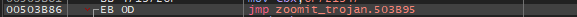
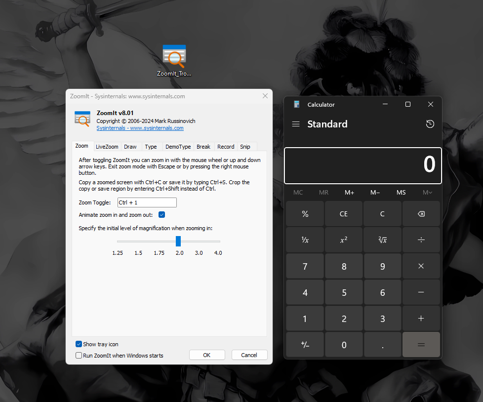

`Entry point`

```c
00F10126 | E8 56020000              | call putty.F10381                       |
00F1012B | E9 7AFEFFFF              | jmp putty.F0FFAA                        |
00F10130 | 55                       | push ebp                                |
```

`Code cave`

```c
00F38200 | 0000                     | add byte ptr ds:[eax],al                |
```

Change entry point and jump to code cave that contains the shell code that we’ll paste.


`Shell code`


Then added an instruction where it’ll go back to the main program so it’ll become a Trojan.


`POPFD Address`

```c
00E53B95 | 9D                       | popfd                                   |
```

I also removed the exit instruction and make it jump on POPFD address so the trojan will execute correctly.


Screenshot



**Screenshot**


